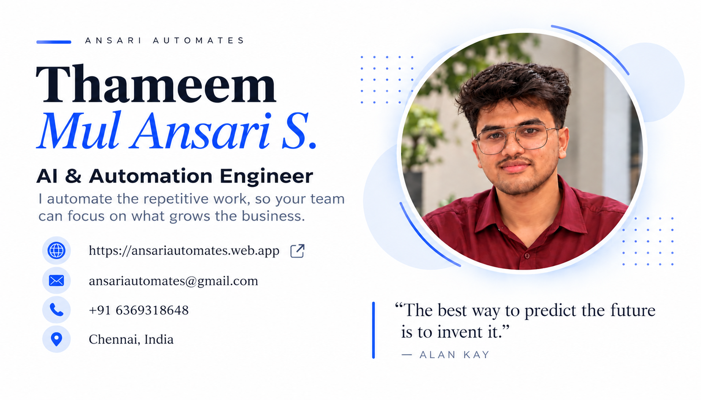

<div align="center">



# Thameem Mul Ansari S

**AI & Automation Engineer · Chennai, India**

I build AI agents, voice agents and automations that take repetitive work off people's desks, for enterprise clients.

[](https://ansariautomates.web.app)
[](https://www.linkedin.com/in/thameem-mul-ansari-s)
[](mailto:thameemmulansaris@gmail.com)

🟢 **Open to new roles and freelance projects**

</div>

---

## 👋 About me

I'm an AI & Automation Engineer with 2+ years of building production AI agents, voice agents, RAG systems and RPA workflows for enterprise clients across the UAE and India.

I own delivery end to end: architecture, Python and FastAPI backends, React and TypeScript dashboards, LangGraph orchestration on Azure OpenAI, and cloud deployment.

- 🎓 **Education:** B.Tech in Information Technology (Honors), Meenakshi Sundararajan Engineering College, Chennai, 2021 – 2025, CGPA 8.48 / 10
- 🏆 **Achievements:** 5× hackathon winner, including the Scale India 91 Hackathon, an internal corporate hackathon and several college hackathons
- 💼 **Currently:** Junior Software Engineer at Unlimited Innovations, Chennai

### Results from client work

| | |
| --- | --- |
| **~40%** | faster turnaround planning for an oil & gas program |
| **~70%** | of routine hotel reservation calls handled by voice agents |
| **90%+** | answer accuracy from the hotel RAG knowledge base |
| **100%** | of manual call auditing replaced by call analytics |

---

## 🚀 Selected work

| Project | What it does | Result | Built with |
| --- | --- | --- | --- |
| **Multi-agent turnaround orchestration** | Six specialised AI agents that plan, monitor and de-risk an oil & gas turnaround program | ~40% shorter planning cycle; issues flagged 2–3 days earlier | LangGraph, Azure OpenAI, RAG, Flask, React, SQL Server, SAP |
| **AI voice agents for hotel reservations** | Phone agents that book, reschedule and cancel stays, and hand off to a human when needed | ~70% of routine calls automated; 90%+ answer accuracy | Twilio, Azure OpenAI GPT Realtime, RAG, Python |
| **Customer-support call analytics** | Every support call transcribed, scored and analysed automatically | 100% of manual call auditing replaced | Whisper, Azure GPT-4, Flask, React |
| **Social media engagement automation** | Multi-agent n8n system replying to Instagram, Facebook and Google Reviews | 4 channels handled automatically | n8n, Meta Graph API, VLMs, Shopify |
| **Sensei, AI teaching assistant** | Avatar tutor that builds a syllabus from documents and answers raised hands live | Live AI Q&A for students | Azure Avatar, FastAPI, React, Supabase |
| **Payment reconciliation bot** | RPA matching PhonePe, Paytm and Pine Labs settlements against Odoo | 3 payment gateways reconciled automatically | Power Automate Desktop, Excel, Cashfree, Shopify |

👉 Screenshots and full case studies: **[ansariautomates.web.app/projects](https://ansariautomates.web.app/projects)**

---

## 🛠️ Services

| Service | What's included |
| --- | --- |
| **AI Enablement** | AI chatbots and assistants for websites and WhatsApp · AI agents for operations · workflow automation with n8n, Power Automate and Zapier · document and finance automation · social media automation |
| **Data & Analytics** | Power BI dashboards and reporting · Microsoft Fabric data pipelines · insights from calls, sales and operations · scheduled reports |
| **Cloud Adoption** | Deploying AI apps on Azure, AWS and Google Cloud · moving manual processes to the cloud · hosting, monitoring and CI/CD |
| **Application Development** | Websites and web apps with SEO · mobile apps · business systems for billing, GST, inventory, sales and CRM · ERP, Shopify and payment integrations |
| **Training & Workshops** | Corporate workshops on AI, automation and n8n · courses in Python, C, C++, Full Stack, AI, n8n, Power BI, Excel and SQL · pitch and presentation coaching |

**Also available:** pitch decks and business presentations.

**Industries:** Energy (Oil & Gas) · Hospitality · Retail & E-commerce · Financial Services · Healthcare · Manufacturing · Logistics & Transportation · Education

💬 **Not sure where to start?** [send a message](https://ansariautomates.web.app/#contact).

---

## 🧰 Tech stack

**AI & agents**


**Voice & conversational AI**


**Automation & RPA**


**Development**


**Cloud**


**Data & integrations**


**CI/CD & DevOps**


---

## 📜 Certifications

| Certification | Issuer |
| --- | --- |
| **PL-500**: Power Automate RPA Developer Associate | Microsoft |
| **AI-900**: Azure AI Fundamentals | Microsoft |
| **DP-600**: Fabric Analytics Engineer Associate | Microsoft |
| **DP-700**: Fabric Data Engineer Associate | Microsoft |

---

## 🌐 About this repository

This repository is the source of my portfolio, **[Ansari Automates](https://ansariautomates.web.app)**.

- **Built with:** Astro, React, Groq (Ansari AI chat), n8n (contact form), hosted on Firebase
- **Highlights:** a physics-driven hanging ID card, typewriter intro, project pop-ups with image carousels, and Ansari AI, an assistant that answers questions about my work
- **SEO:** static pages, structured data, sitemap and social previews
- **Deploys automatically** to Firebase Hosting through GitHub Actions on every push to `main`

### Run it locally

```bash
npm install
cp .env.example .env    # add your Groq key and settings
npm run dev             # http://localhost:4321
```

Adding projects or certifications? See **[ADDING-PROJECTS.md](ADDING-PROJECTS.md)**.

---

<div align="center">

**Let's build something that runs itself.**

[ansariautomates.web.app](https://ansariautomates.web.app) · [thameemmulansaris@gmail.com](mailto:thameemmulansaris@gmail.com)

</div>
